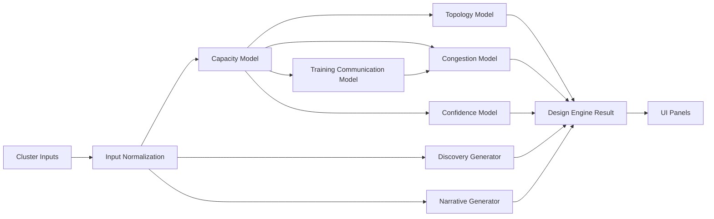

# AI Fabric Architecture Studio Technical Design

## Purpose

AI Fabric Architecture Studio is a frontend-only architecture assistant for early-stage enterprise AI fabric design conversations.

## Repo integration note

This document describes the reference planner surface under `src/features/cluster-designer/`. The running Optics Master product still uses the root-level live shell.

Use this document for reference planner modeling and UX philosophy. Use `docs/ARCHITECTURE_SURFACES.md` and the root-level planner modules for live app implementation work.

AI Fabric Architecture Studio is a frontend-only architecture assistant for early-stage enterprise AI fabric design conversations. It helps Arista-oriented systems engineers reason about Ethernet AI cluster topology, capacity posture, oversubscription, congestion, training communication pressure, and design confidence without pretending to be a pricing tool, validated SKU configurator, or performance simulator.

This document describes the current v1.1 technical design, the model boundaries, and the main extension points for future work.

## Design goals

- Keep the product assumption-driven and technically credible
- Make model stages readable and easy to extend
- Separate modeling, orchestration, data profiles, and presentation
- Preserve a premium principal-architect workspace aesthetic
- Favor category-driven guidance over fake numeric precision

## Explicit non-goals

- Exact validated Arista SKU recommendation
- Pricing or commercial quoting
- Packet-level or job-level simulation
- Backend persistence or multi-user workflow
- Pod-aware, rail-aware, or rack-exact physical design in v1

## Repo structure

```text
src/
  components/
    layout/
    ui/
  features/cluster-designer/
    components/
    context/
    data/
    engine/
    lib/
    models/
    pages/
    types.ts
  styles/
    designTokens.ts
docs/
  TECHNICAL_DESIGN.md
```

## Core architecture

The cluster-designer feature is organized into four main layers.

### 1. Profile and assumption data

The `data/` layer stores the configurable assumption profiles used by the models:

- `platformProfiles.ts`
  Family-level leaf/spine platform classes and port assumptions
- `workloadProfiles.ts`
  Workload modifiers and enterprise research posture assumptions
- `fabricProfiles.ts`
  Oversubscription, headroom, and design-boundary text
- `defaults.ts`
  Default input state
- `presets.ts`
  Research workload presets for live customer discussion flows

This layer is intentionally descriptive rather than exact. It contains the assumptions the engine uses to produce directional recommendations.

### 2. Model layer

The `models/` layer contains small, focused heuristic modules:

- `capacityModel.ts`
  Converts normalized inputs into host bandwidth, growth-adjusted demand, leaf-facing port demand, and uplink demand
- `topologyModel.ts`
  Converts capacity posture into a topology recommendation and node/link graph
- `congestionModel.ts`
  Produces congestion severity, primary drivers, and mitigation guidance
- `trainingCommunicationModel.ts`
  Explains collective communication pressure, burst behavior, and oversubscription ceiling guidance
- `confidenceModel.ts`
  Separates model confidence from design risk

The main rule for this layer is that each model should answer one architectural question clearly and return typed categorical output where exact validation is not possible.

### 3. Engine orchestration

The `engine/` layer currently centers on:

- `designEngine.ts`

This module is the orchestration boundary. It should not become a constant dump or a second model layer.

Current pipeline:

1. Normalize user input into `NormalizedDesignInputs`
2. Derive capacity using the capacity model
3. Derive topology using the topology model
4. Assess training communication pressure
5. Assess congestion risk
6. Assess confidence
7. Generate discovery questions
8. Generate structured narrative
9. Assemble the final `DesignEngineResult`

The engine result is the canonical UI-facing model. Panels should prefer consuming it directly or through lightweight selectors instead of building parallel derived DTOs.

### 4. Presentation layer

The `components/` layer is structured around scan-first architectural review rather than report-style prose.

Important panels:

- `RecommendedArchitectureHero.tsx`
  Main answer surface for topology, oversubscription, congestion, and confidence
- `FabricPressureZone.tsx`
  Unified band for oversubscription, congestion, and training communication
- `TopologyView.tsx`
  Fabric shape and architecture diagram
- `PortConsumptionChart.tsx`
  Capacity summary
- `DiscoveryWorkflowPanel.tsx`
  Interactive customer discovery workflow
- `AssumptionMap.tsx`
  Compact representation of assumptions and follow-up validation areas
- `DesignNarrativePanel.tsx`
  Condensed narrative and tradeoff explanation
- `NextValidationStepsPanel.tsx`
  Explicit follow-on engineering checklist

The page-level composition is handled by:

- `pages/ClusterDesignerPage.tsx`

This page acts as the workspace shell for the feature.

## Type system

The main domain types live in:

- `src/features/cluster-designer/types.ts`

Important interfaces:

- `DesignInputs`
- `NormalizedDesignInputs`
- `DerivedCapacity`
- `TopologyRecommendation`
- `CongestionRiskAssessment`
- `TrainingCommunicationAssessment`
- `DesignConfidenceAssessment`
- `DesignEngineResult`

The type system is intentionally explicit because the tool is largely a modeling product. Clear intermediate types make the heuristic chain understandable and reduce drift between the engine and the UI.

## Data flow



## Modeling philosophy

### Capacity

Capacity is derived from host-facing demand first, then adjusted by growth and shared-fabric assumptions. The output expresses:

- host-facing bandwidth
- host-facing port counts
- growth-adjusted leaf-facing demand
- estimated uplink demand
- actual versus target oversubscription

The model is not attempting switch-level validation. It is trying to expose the structural consequences of bandwidth, growth, and oversubscription choices.

### Topology

Topology is currently directional and enterprise-oriented:

- leaf-spine posture
- estimated leaf and spine counts
- conceptual node/link rendering

The current logic is ready for future pod-aware or rail-aware extension. The code deliberately avoids overcommitting to one permanently flat-cluster assumption.

### Congestion

Congestion is a heuristic severity model, not a benchmark engine. It combines:

- oversubscription posture
- east-west traffic intensity
- storage sharing behavior
- training communication pressure
- NIC profile
- scale sensitivity

The output is categorical:

- `low`
- `moderate`
- `high`
- `severe`

This is intended for architectural tradeoff discussion, not deterministic performance prediction.

### Training communication

The training communication model exists to explain why training traffic behaves differently from ordinary enterprise traffic.

Inputs include:

- collective pattern
- training communication intensity
- synchronization sensitivity
- cluster scale class
- current oversubscription
- shared storage posture

Outputs include:

- communication pressure
- east-west burst factor
- oversubscription ceiling guidance
- architecture note
- training risk note

This model is deliberately heuristic and should remain explanatory rather than pseudo-scientific.

### Confidence

Confidence is not the same as congestion or design risk.

Low confidence can mean:

- missing storage detail
- heuristic-heavy communication assumptions
- aggressive oversubscription posture
- workload intensity that needs customer validation

That distinction is important in customer-facing architecture work because an aggressive design can still be directionally sound, while an apparently safe design can still have low confidence if the inputs are weak.

## UI system

### Design tokens

The design system is centralized in:

- `src/styles/designTokens.ts`

It defines:

- background, surface, border, and divider colors
- text hierarchy
- accent colors by domain
- glow and elevation behavior
- spacing rules

This token file is the source of truth for the premium principal-architect workspace aesthetic.

### UI primitives

Reusable UI primitives live in `src/components/ui/` and include:

- `ArchitectureCard.tsx`
- `Chip.tsx`
- `Disclosure.tsx`
- `InfoTooltip.tsx`
- `MetricTile.tsx`

These primitives are used to keep the product scan-first and to move deeper explanation behind progressive disclosure rather than showing large blocks of text by default.

### Progressive disclosure strategy

The current UI uses four information layers:

1. Immediate answer
   Recommendation hero, key metrics, pressure indicators
2. Interactive analysis
   Topology, pressure zone, discovery workflow
3. Secondary explanation
   Chips, tooltips, disclosures, hover states
4. Deep reasoning
   Narrative, customer talk track, validation checklist

This is intentional. The app is meant to behave like an architecture instrument, not a static design memo.

## Visual renderers

### Topology renderer

`components/topologyRenderer.tsx` produces a lightweight SVG topology visualization.

Current behavior:

- renders spine nodes, leaf nodes, and grouped server nodes
- uses hover states to explain each fabric layer
- communicates 2-tier scale-out structure
- remains conceptual rather than physical

### Training communication diagram

`components/TrainingCommunicationDiagram.tsx` renders a simplified explanatory SVG for:

- ring all-reduce
- tree all-reduce
- hierarchical communication
- mixed / unknown communication

The purpose is teaching and customer explanation, not performance simulation.

## Comparison support

The UI contains lightweight comparison-oriented components such as:

- `CompareSummaryPanel.tsx`
- `ChangeImpactPanel.tsx`

These are intentionally scoped as groundwork rather than a full comparison workflow. The codebase should keep comparison logic isolated so future A/B scenario work can grow without contaminating the main engine or primary design path.

## Extension points

Expected v2 or later extension areas:

- pod-aware modeling
- rail-aware design logic
- multi-pod topology recommendations
- rack-aware placement and optics reach validation
- exportable customer summaries
- richer scenario comparison
- automated tests for model cases and UI selectors

When extending the engine, prefer:

- adding or evolving a small model module
- updating the engine orchestration step sequence
- exposing the result through the canonical `DesignEngineResult`

Avoid:

- embedding new logic directly in presentation components
- introducing parallel result models
- hiding major assumptions in the UI layer

## Operational guidance for contributors

- Keep assumption constants in `data/` or model modules, not buried in page code
- Treat `DesignEngineResult` as the canonical UI contract
- Use typed intermediate outputs when adding model stages
- Preserve explicit design boundaries in user-facing text
- Prefer concise, technically grounded copy over marketing language
- Do not imply exact SKU validation, job completion time, or benchmark-grade confidence

## Current technical debt and known tradeoffs

- The chart path remains one of the larger UI bundles and may need further isolation if the app grows materially
- Comparison support is intentionally partial and should remain isolated until a real scenario-comparison product shape is defined
- Validation checklist content is still mostly static and could later become model-informed without pretending to be deployment-ready validation
- The current topology model is still cluster-level and not yet pod-aware or rail-aware

## Summary

The current architecture is designed to support a high-quality v1.1 product:

- readable model stages
- explicit assumptions
- scan-first UI
- strong separation between risk, confidence, and architectural tradeoffs
- clear room for pod-aware and deeper enterprise AI design evolution later

That is the correct level of rigor for an early-stage enterprise Ethernet AI fabric design assistant.
